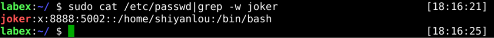

# Modify User Account

User properties do not remain unchanged after they are created, and sometimes they are modified depending on the situation.

The `usermod` command can help us modify user attributes.

Several operations are described below, and more can be found in the help file with the `usermode -h` command.

## Modify User Home Directory

A user created will have an associated home directory, but what should you do if you want to change that user's home directory?

Next, You should modify the `joker` user's home directory to `/home/shiyanlou`.

## Modify User Uid

As mentioned above, in this section, you will change the uid of the `joker` user to `8888`.

## Modify User Shell

For the last one, we change the shell mode of the `joker` user to `/bin/bash`.

## Requirements

- must use the `usermod` command.
- must be the `joker` user.
