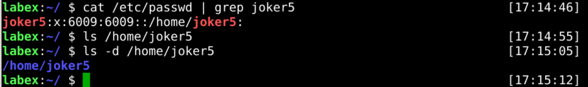

# Create User Account

The `useradd` command creates a user account in the Linux platform, for example:

```bash
sudo useradd username
```

## Create A Normal User

Now, let's create a new user called `joker`.


## Create A User With Group

When using the `sudo useradd joker` command, create a new user account with the same `joker` group. However, sometimes we want to create a new user account with a different group.

Now, we will create a new user called `joker1` with a group named `public`.


## Create A User With Custom Home Directory

Normarlly, create a new user will associated with a home directory. For example, if you create a new user called `joker`, it will associated with a directory called `/home/joker`.


However, you will encounter problems when you create a new user with a custom home directory. Fortunately, the `useradd` command has the ability to do this.

Now, let's create a new user called `joker2` with a custom home directory `/home/shiyanlou`.


## Create A User Without A Home Directory

In addition to the home directory, sometimes we want create a new user account without a home directory. For example `ngnx` user, it's only used to manage processes.


## Create A User Without login

Therefore, it is a common requirement to create an account that does not allow logins.

Now, let's create a new user called `joker4` without login.


## Create A User With A Home Directory

Congratulations, you have successfully completed all the tasks above.

How do you achieve it?

Now, you can try creating a new user called `joker5` with home directory `/home/joker5`.



## Requirements

- must use the `useradd` command.
