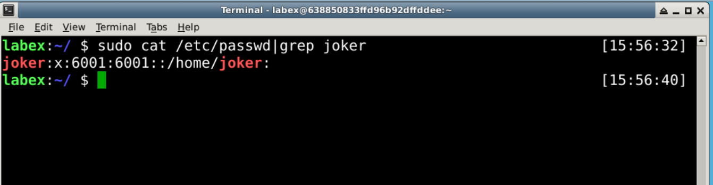
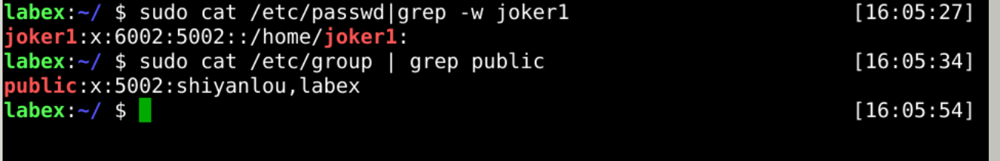
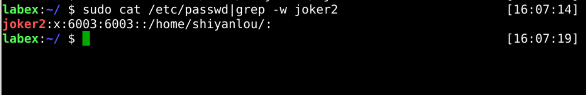
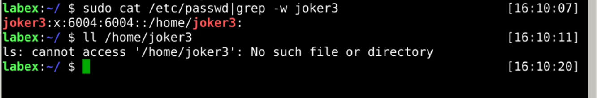
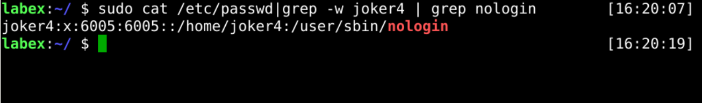

# Create user account

The `useradd` command create user account in Linux platform, for example:

```bash
sudo useradd username
```

## Create a normal user

Let's create a new user called `joker`.



## Create a user with group

Let's create a new user called `joker1` with group `public`.



## Create a user with custom home directory

Let's create a new user called `joker2` with custom home directory `/home/shiyanlou`.


## Create a user without home directory

Let's create a new user called `joker3` without home directory.



## Create a user without nologin

Let's create a new user called `joker4` without nologin.



## Create a user with home directory

Let's create a new user called `joker5` with home directory `/home/joker5`.



## Requirements

- must use the `useradd` command.
