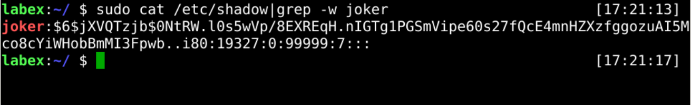
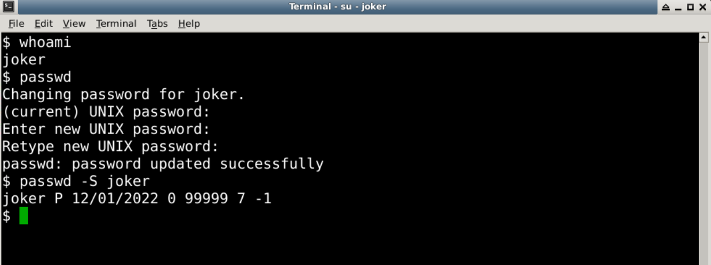

# Manege User Password

The `passwd` command change password for a user account. A regular user may only change the password for their account, while the superuser may change the password for any account. For example:

```bash
passwd username
```

## Set User Password

In the first step, we only created the user and did not set a password for the user. Next, we set the password for the user. The administrator should set the appropriate password if a user needs to log in to the operating system.

Now, let's set a password for the `joker` user.

> Tip: You need to use an administrator account or use an account with sudo privileges



## Change Own Password

Every once in a while, we need to update our passwords to secure our accounts effectively.

Now, you can try to change your password with the `joker` user.



## Requirements

- must use the `passwd` command.
- must be the `joker` user.
