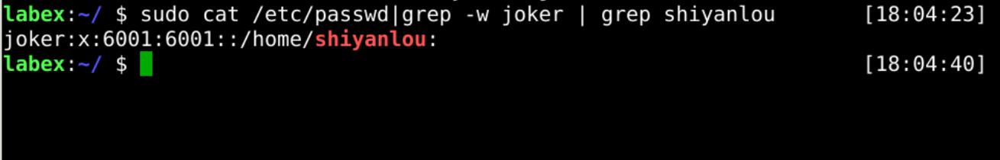
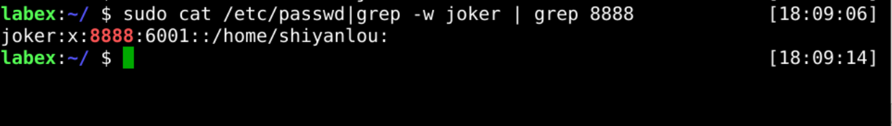
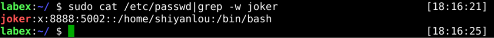

# Modify user account

The `usermod` command can modify the user account.

## Modify user home directory

Modify the `joker` user's home directory to `/home/shiyanlou`.

## Modify user uid

Modify the `joker` user's uid to `8888`.

## Modify user shell

Moify the `joker` user's shell to `/bin/bash`.

## Requirements

- must use the `usermod` command.
- must be the `joker` user.
