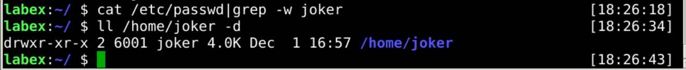
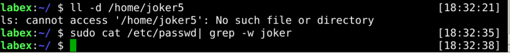

# Delete User Account

If a user is no longer needed, we need to clean it up, and it is a good habit to keep user data clean.

In Linux, it is common to use the `userdel` command to clean up user data. For example:

```bash
userdel username
```

## Delete User Without Home Directory

When deleting a user, it is often necessary to retain the user data to avoid losing the needed data.

Now, we need to delete the `joker` user but keep its home directory.



## Delete User And Home Directory

If we determine that a user and his data are no longer needed, we can delete them.

For example, we have determined that `joker5` users and data are no longer needed, and now we want to delete them.



## Requirements

- must use the `userdel` command.
- must be the `joker` and `joker5` user.
