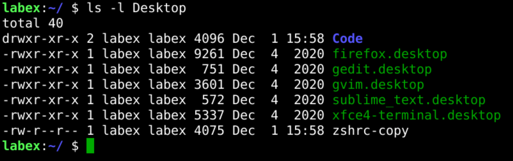

# Copy Files and Directories

This challenge is about copying files and directories.

Try to copy the `~/.zshrc` file to the `~/Desktop/zshrc-copy` and copy the `~/Code` directory to the `~/Desktop`.

## Example

## Requirements

- Copy the `~/.zshrc` file to the `~/Desktop/zshrc-copy` file.
- Copy the `~/Code` directory to the `~/Desktop` directory.
