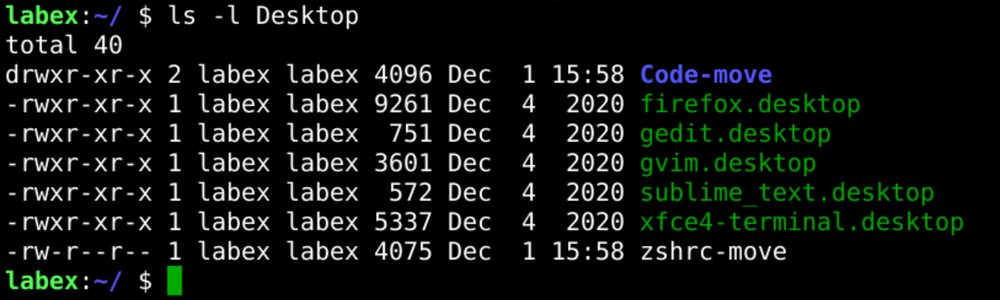

# Move Files and Directories

This challenge is about moving files and directories.

Try to move the `~/Desktop/zshrc-copy` file to the `~/Desktop/zshrc-move` and move the `~/Desktop/Code` directory to the `~/Desktop/Code-move`.

## Example

## Requirements

- Copy the `~/Desktop/zshrc-copy` file to the `~/Desktop/zshrc-move` file.
- Copy the `~/Desktop/Code` directory to the `~/Desktop/Code-move` directory.
