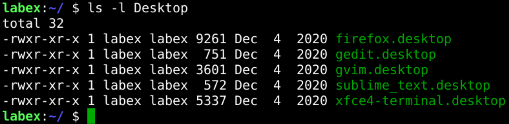

# Remove Files and Directories

This challenge is about removing files and directories.

Try to remove the `~/Desktop/zshrc-move` file and remove the `~/Desktop/Code-move` directory.

## Example

## Requirements

- Remove the `~/Desktop/zshrc-move` file.
- Remove the `~/Desktop/Code-move` directory.
