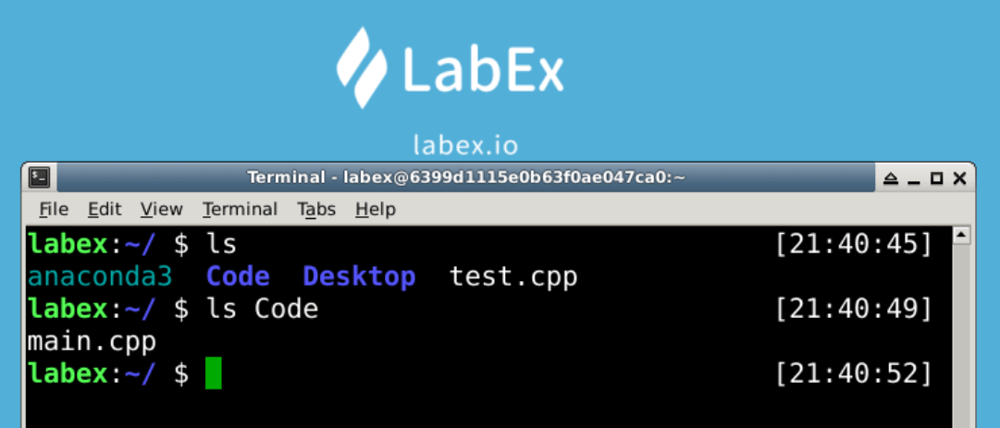

# Create Files

This challenge is about craeting files.

Try to create a file named `test.cpp` in the `~` directory and create a file named `main.cpp` in the `~/Code` directory.

## Example

## Requirements

`~` is the default directory in which a terminal is opened by default.

- Create a file named `test.cpp` in the `~` directory with `touch` command.
- Create a file named `main.cpp` in the `~/Code` directory with `touch` command.
