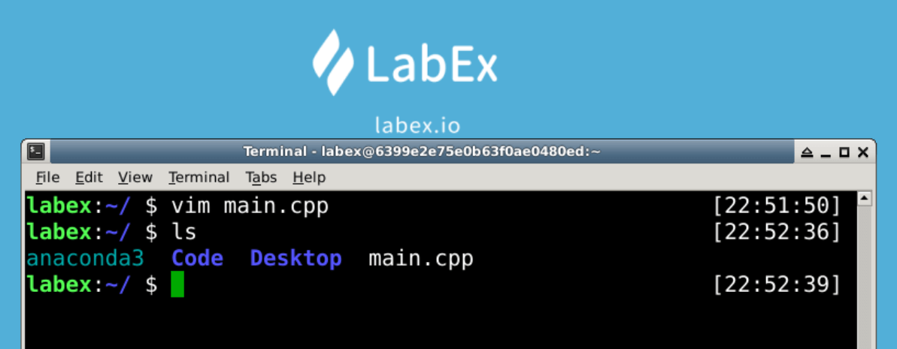

# Create Files

This challenge is about opening and saving a file.

`vim` is a text editor that can open and save a file.

Try to create a file named `main.cpp` in the `~` directory with `vim` command.

## Example

## Requirements

`~` is the default directory in which a terminal is opened by default.

- Open a file named `main.cpp` in the `~` directory with `vim` command.
- Type `#include` in the file.
- Save the file.
