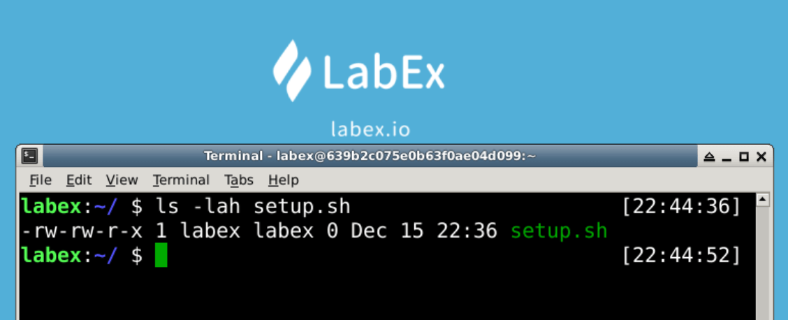

# Modify File Permissions

This challenge is about modifying the file permissions.

Try to change the file permissions named `main.cpp` in the `~` directory with `chmod` command.

## Example

## Requirements

- Create a file named `setup.sh` in the `~` directory with `touch` command.
- Add executable permissions to Other Users of the `setup.sh` script file.
