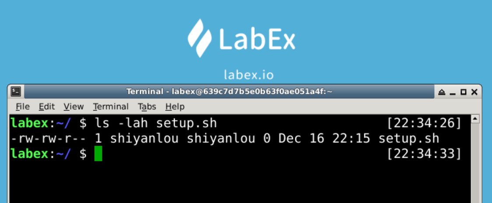

# Modify File Owner

This challenge is about modifying the file owner.

`chown` command requires superuser `root` privileges to execute this command.

## Example

## Requirements

- Create a file named `setup.sh` that belongs to user `labex` in the `~` directory.
- Change the file owner to `root`.
