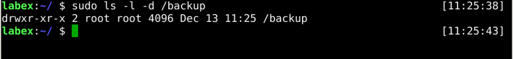
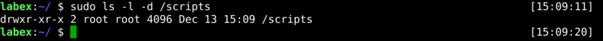

# Preparation

## Introduction

In this Step, We will do some prep work, mainly creating a local backup directory and a storage directory on the backup server.

## Target

You aim to create the `/backup` and `/scripts` directories on the server. The `/backup` directory is used to store backup files, and the `/scripts` directory is used to store backup scripts.

## Result Example

Here's an example of what you should be able to accomplish by the end of this challenge:

1. Create a new directory called `/backup`.

   

2. Create a new directory called `/scripts`.

   

## Requirements

To complete this challenge, you will need:

- An account with `sudo` privileges.
- Know how to create directories on Linux
