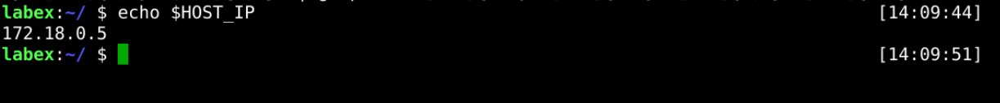
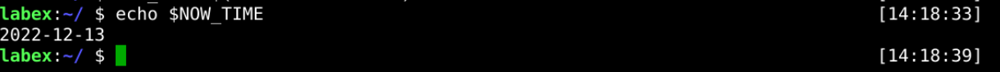
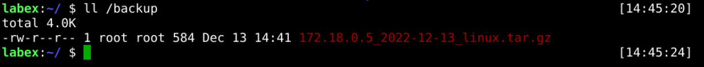
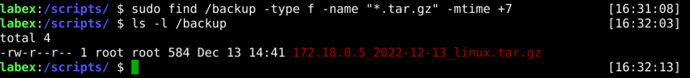

# Packing System Log

## Introduction

In this step, We will pack the log files into the local backup directory.

We do not back up all log files, only the following logs:

- `/var/log/dmesg` - record kernel buffer information.
- `/var/log/faillog` - record user login failure information.
- `/var/log/lastlog` - record the most recent information of all users.

## Target

Your goal is to compress and package the three log files mentioned earlier in the format `192.168.100.100_2022-10-11_linux.tar.gz`. You will need to remove the packed files from `7 days ago` to save disk space.

## Result Example

Here's an example of what you should be able to accomplish by the end of this challenge:

1. Get the host's IP address and save it to the `HOST_IP` variable.

   

2. Get the current time and save it to the `NOW_TIME` variable.

   

3. Pack the above log file into a zip file.

   

4. Delete the backup file from 7 days ago.

   

## Requirements

To complete this challenge, you will need:

- Know how to configure environment variables in Linux.
- Know how to compress files.
