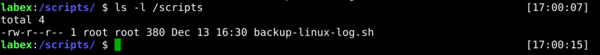
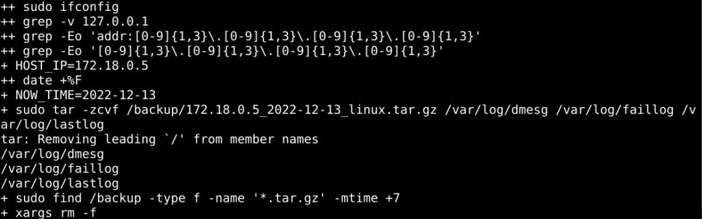
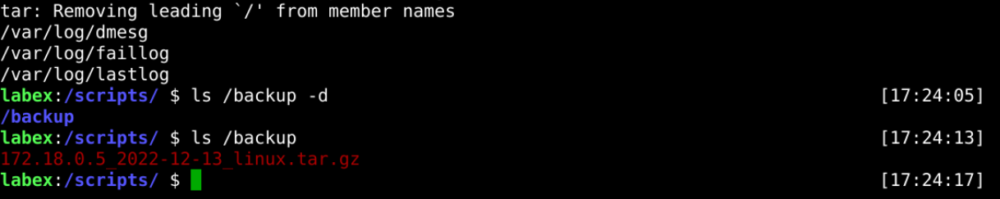

# Develop Backup Scripts

## Introduction

It would be very cumbersome to use separate commands to back up the logs each time, and the best way to do this is to organize them into scripts.

## Target

Your goal is to organize the log backup operations in `step 2` into a script with the name `backup-linux-log.sh`, and test that the script works correctly.

## Result Example

Here's an example of what you should be able to accomplish by the end of this challenge:

1. Create the `backup-linux-log.sh` file in the /scripts directory and write the actions from `step 2`.

   

2. Check the script syntax for problems.
   

3. Execute the script to see if creating the backup file is successful.

   

## Requirements

To complete this challenge, you will need:

- Know the specific steps to backup log files.
- Know how to develop Shell scripts and test them.
