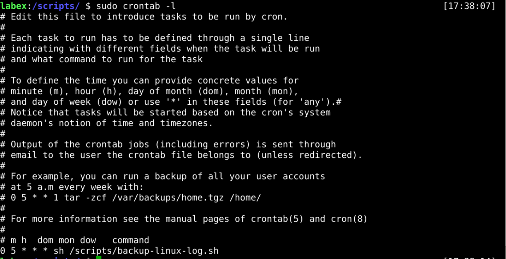

# Add Cron Job

## Introduction

Backing up logs is a routine operation that must be performed weekly or even daily, for which we must add the script as an automatic task.

## Target

Your goal is to add the backup script developed in `step 3` to a timed task that requires the backup script to be executed every morning at `5am`.

## Result Example

Here's an example of what you should be able to accomplish by the end of this challenge:

1. Create a timed task that performs a backup daily at 5 am.

   

## Requirements

To complete this challenge, you will need:

- Know how to add Cron Job in Linux.
