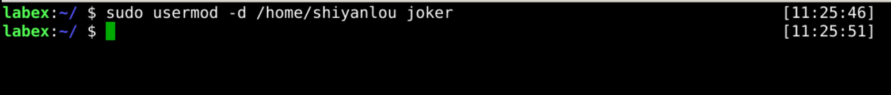
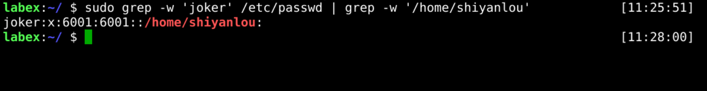
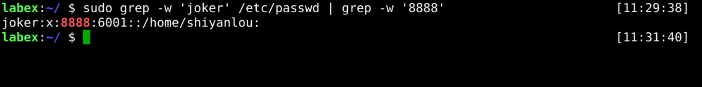
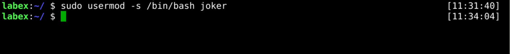
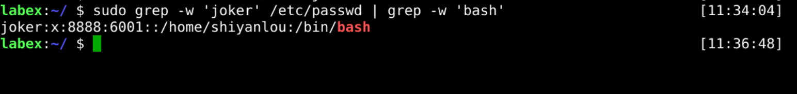

# Modify User Account

User properties do not remain unchanged after they are created, and sometimes they are modified depending on the situation.

The `usermod` command can help us modify user attributes.

Several operations are described below, and more can be found in the help file with the `usermode -h` command.

## Modify User Home Directory

A user created will have an associated home directory, but what should we do to change that user's home directory?

The following example shows how to modify the `joker` user's home directory to `/home/shiyanlou`.

```bash
sudo usermod -d /home/shiyanlou joker
```



Then we can use the `grep` command to check it.

```bash
sudo grep -w 'joker' /etc/passwd | grep -w '/home/shiyanlou'
```



## Modify User Uid

As mentioned above, in this section, we will change users' uid.

The following example shows how to change the uid of the `joker` user to `8888`.

```bash
sudo usermod -u 8888 joker
```


Next, we need to check if the settings are correct.

```bash
sudo grep -w 'joker' /etc/passwd | grep -w '8888'
```



## Modify User Shell

For the last one, we change the shell mode of the `joker` user to `/bin/bash`.

```bash
sudo usermod -s /bin/bash joker
```



Next, we check that the joker user's shell is set up correctly.

```bash
sudo grep -w 'joker' /etc/passwd | grep -w 'bash'
```


