# Create User Account

The `useradd` command creates a user account in the Linux platform, for example:

```bash
sudo useradd username
```

## Create A Normal User

Now, let's create a new user called `joker`.

This image has a `useradd` command that creates a user account in the Linux platform, for example:

```bash
sudo useradd joker
```

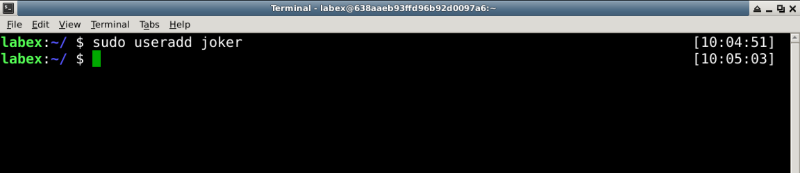

After the user is created, the account will be saved in the `/etc/passwd` file, and you can use the `grep` command to see if the user exists.

```bash
sudo grep -w 'joker' /etc/passwd
```

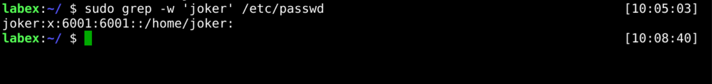

## Create A User With Group

When using the `sudo useradd joker` command, create a new user account with the same `joker` group. However, sometimes we want to create a new user account with a different group.

The following example shows how to create a new user called `bill` with a `public` group.

First, we need to check if the `public` group user exists.

```bash
sudo grep -w 'public' /etc/group
```

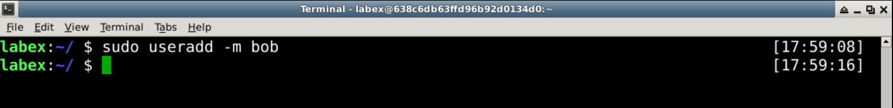

If the `public` group user does not exist, then we can create the `public` group user.

```bash
sudo groupadd public
```

Next, we can create `bill` users with the `public` group.

```bash
sudo useradd bill -g public
```

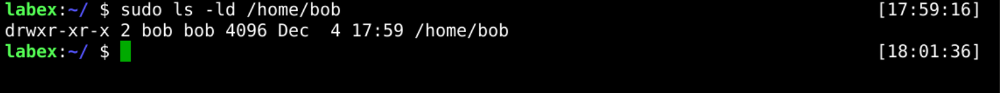

Now that we have created the `bill` account, we can use the `grep` command to check if the user exists.

```bash
sudo grep -w 'bill' /etc/passwd
```

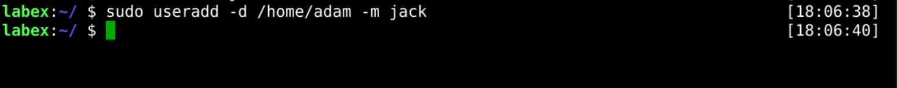

## Create A User With Custom Home Directory

Usually, creating a new user will be associated with a home directory. For example, creating a new `joker` user will be associated with a directory called `/home/joker`.


However, you will encounter problems when you create a new user with a custom home directory. Fortunately, the `useradd` command can do this.

The following example shows how to create a new user called `bob` with a custom home directory `/home/shiyanlou`.

First, you can use the `ls` command to check if the home directory exists.

```bash
sudo ls /home/shiyanlou -ld
```

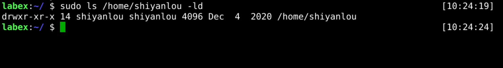

If the home directory does not exist, you can create it.

Next, we can create `bob` users with a home directory.

```bash
sudo useradd bob -d /home/shiyanlou
```

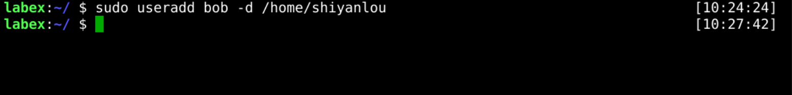

Now you can check if `bob` user exists, and his home directory is `/home/shiyanlou`.

```bash
sudo grep -w 'bob' /etc/passwd | grep -w '/home/shiyanlou'
```

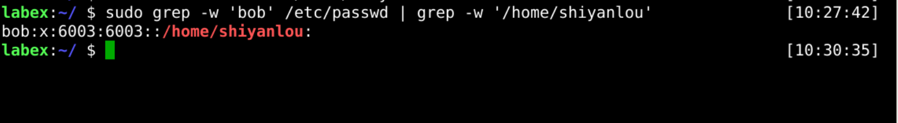

## Create A User Without A Home Directory

In addition to the home directory, sometimes we want to create a new user account without a home directory. For example, the `ngnix` user it's only used to manage processes.

The following example shows how to create a new user called `cary` without a home directory.

```bash
sudo useradd -M cary
```

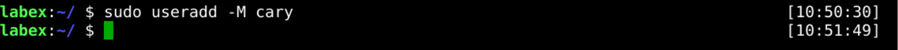

Now you can check if `cary` user exists and if the home directory does not exist.

```bash
sudo grep -w 'cary' /etc/passwd
sudo ls -ld /home/cary
```

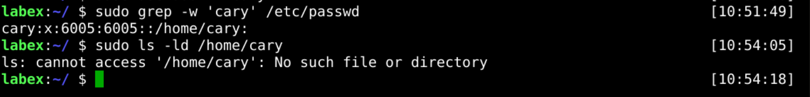

## Create A User Without Login

Therefore, creating an account that does not allow logins is a common requirement.

The following example shows how to create a new user called `glen` without login.

```bash
sudo useradd -s /user/bin/nologin glen
```

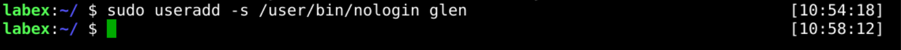

Now you can check if the `glen` user exists and if the home directory does not exist.

```bash
sudo grep -w 'glen' /etc/passwd | grep -w 'nologin'
```

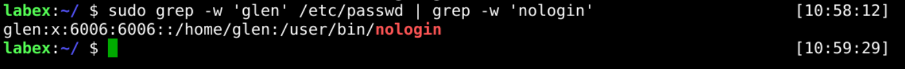

## Create A User With A Home Directory

Congratulations, you have completed all the tasks above.

The following example shows how to create a new user called `gordon` with the home directory `/home/gordon`.

```bash
sudo useradd -m gordon
```

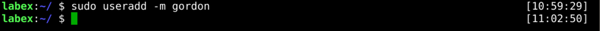

Now you can check if the `gordon` user exists and if the home directory `/home/gordon` exists.

```bash
sudo grep -w 'gordon' /etc/passwd
sudo ls -ld /home/gordon
```

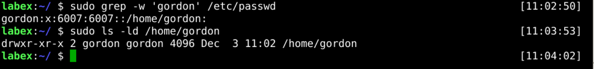

## Requirements

- must use the `useradd` command.
