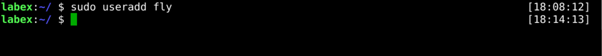
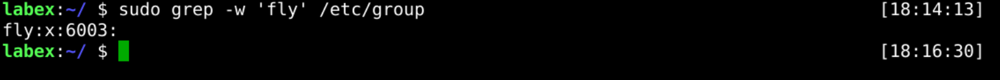
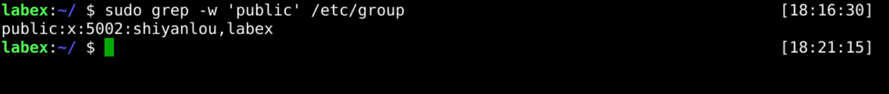
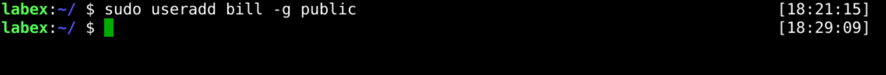

# Manege User Password

The `passwd` command change password for a user account. A regular user may only change the password for their account, while the superuser may change the password for any account. For example:

```bash
passwd username
```

## Set User Password

In the first step, we only created the user and did not set a password for the user. Next, we set the password for the user. The administrator should set the appropriate password if a user needs to log in to the operating system.

Now, let's set a password for the `joker` user.

> Tip: We need to use an administrator account or use an account with sudo privileges

```bash
sudo passwd joker
```



If we can see the command output, we have successfully changed the password of the `joker`. The password will be saved in the `/etc/shadow` file, and we can check it by the `grep` command.

```bash
sudo grep -w 'joker' /etc/shadow
```



## Change Own Password

If we want to change a user's password, we need to set the correct password. The password should be the one originally used to log in to the operating system.

The following example shows how to change the password with the `joker` user.

First, we need to switch to the `joker` user.

```bash
su - joker
```



Next, we can change the password for the `joker` user.

```bash
passwd
```



## Requirements

- must use the `passwd` command.
- must be the `joker` user.
