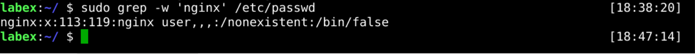
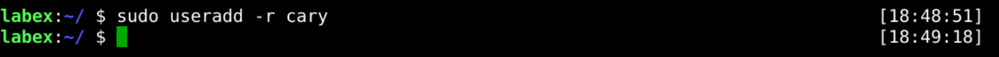
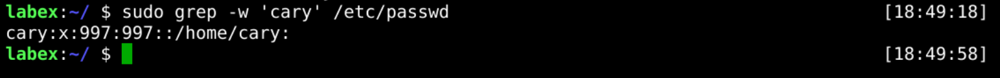
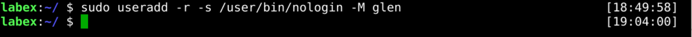
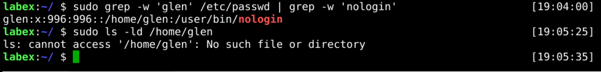

# Manage System User Account

In Linux, there is no real technical difference between a system and a regular user. Typically, a system user is a user that is created when you install the operating system. Sometimes, you may need to create users to run specified applications.

For example, the `ngnix` user it's only used to manage processes.



## Create System User Account

The following example shows how to create a system user called `cary`.

```bash
sudo useradd -r cary
```



Then check the `cary` user information.

```bash
sudo grep -w 'cary' /etc/passwd
```



## Create System User Without Login And Home Directory

Usually, the system user running the application is not required to login. You don't even need a home directory.

The following example shows how to create a new user called `glen` without login and home directory.

```bash
sudo useradd -r -s /user/bin/nologin -M glen
```



Now we can check if the `glen` user exists and if the home directory does not exist.

```bash
sudo grep -w 'glen' /etc/passwd | grep -w 'nologin'
sudo ls -ld /home/glen
```


