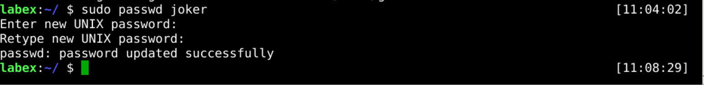
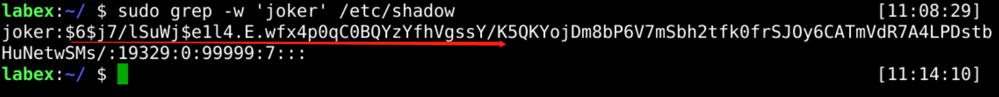
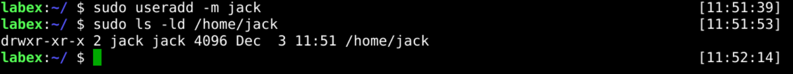
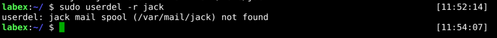
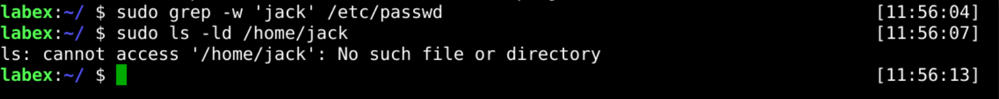

# Delete User Account

If a user is no longer needed, we need to clean it up, and it is a good habit to keep user data clean.

In Linux, it is common to use the `userdel` command to clean up user data. For example:

```bash
userdel username
```

## Delete User Without Home Directory

When deleting a user, it is often necessary to retain the user data to avoid losing the needed data.

Now, we need to delete the `gordon` user but keep its home directory.

```bash
sudo userdel gordon
```



Next, we check if the user is deleted and the home directory is retained.



## Delete User And Home Directory

If we determine that a user and his data are no longer needed, we can delete them.

For example, we have determined that `jack` users and data are no longer needed, and now we want to delete them.

First, we check the `jack` user information.

```bash
sudo grep -w 'bob' /etc/passwd
```



> Tips: If you don't have the jack user, create it using `sudo useradd -m jack` command.

Next, we delete the `jack` user as well as the home directory.

```bash
sudo userdel -r jack
```



Finally, we checked if the deletion was successful.

```bash
sudo grep -w 'bob' /etc/passwd
sudo ls -ld /home/bob
```



## Requirements

- must use the `userdel` command.
- must be the `joker` and `joker5` user.
