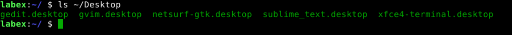
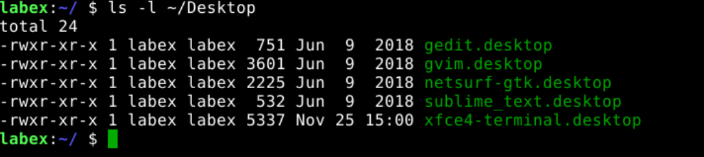
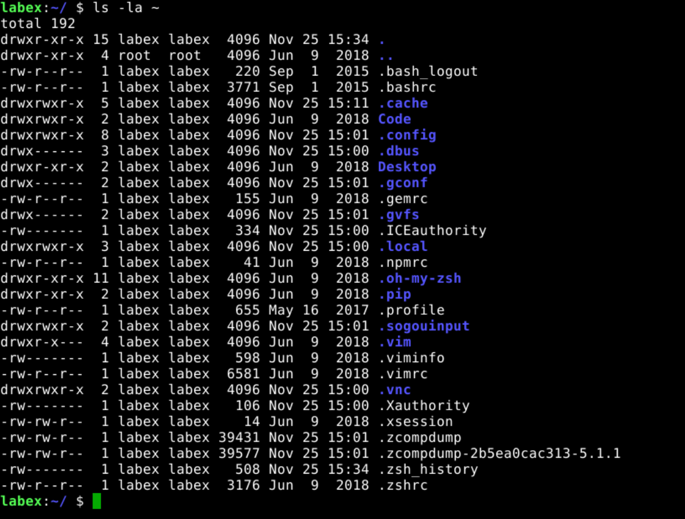
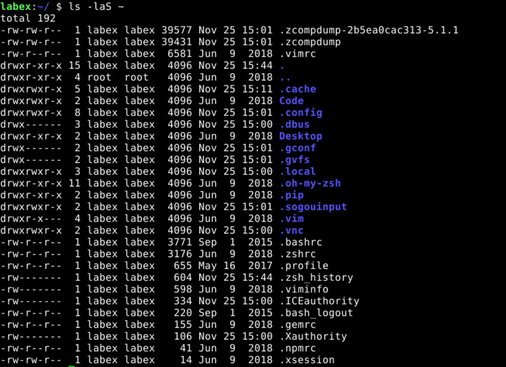
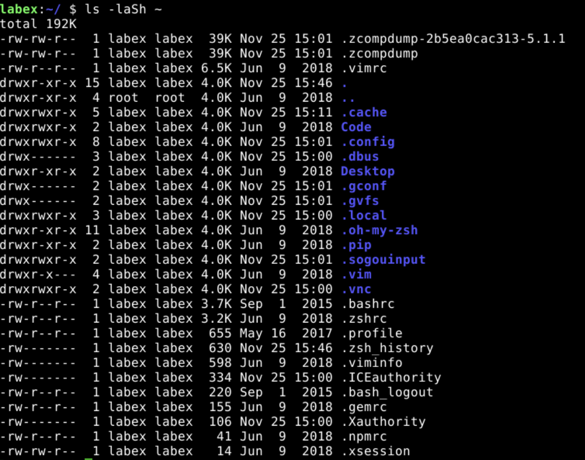

# List Files and Directories

The `ls` command lists files and directories in the current directory. The following example shows how to list files and directories in the current directory.

```bash
ls
```


## List Files and Directories in a Specific Directory

The following example shows how to list files and directories in the `~/Desktop` directory.

> Tips: `~` is a shortcut for the current user's home directory. The default value is `/home/labex` In our environment.

```bash
ls ~/Desktop
```



## List Files and Directories in a Specific Directory With Details

The following example shows how to list files and directories in the `~/Desktop` directory with details.

```bash
ls -l ~/Desktop
```



## List Files and Directories in a Specific Directory With Details and Hidden Files

The following example shows how to list files and directories in the `~` directory with details and hidden files.

> Tips: Hidden files and directories are files and directories that start with a `.` (dot).

```bash
ls -la ~
```



## List Files and Directories in a Specific Directory With Details and Hidden Files and Sort by Size

The following example shows how to list files and directories in the `~` directory with details and hidden files and sort by size.

```bash
ls -laS ~
```



## List Files and Directories in a Specific Directory With Details and Hidden Files and Sort by Size and Human-Readable

The following example shows how to list files and directories in the `~` directory with details and hidden files in reverse order and sort by size and human-readable.

```bash
ls -laSh ~
```


