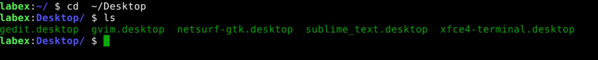
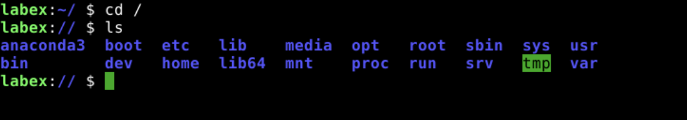
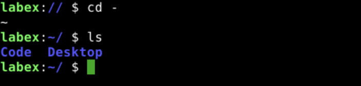

# Change Working Directory

`cd` is a command that allows you to change the current working directory.

The following example shows how to change the current working directory to the `~/Desktop` directory.

```bash
cd ~/Desktop
ls
```



## Change Working Directory to the Parent Directory

The following example shows how to change the current working directory to the parent directory.

```bash
cd ..
ls
```


## Change Working Directory to the Root Directory

The following example shows how to change the current working directory to the root directory.

```bash
cd /
ls
```



## Change Working Directory to the Previous Working Directory

The following example shows how to change the current working directory to the previous working directory.

```bash
cd -
ls
```



## Change Working Directory to the Home Directory

The following example shows how to change the current working directory to the home directory.

```bash
cd ~
ls
```


