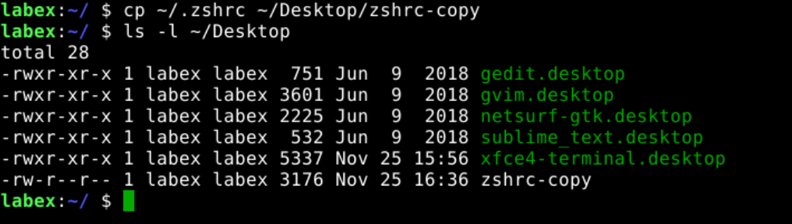
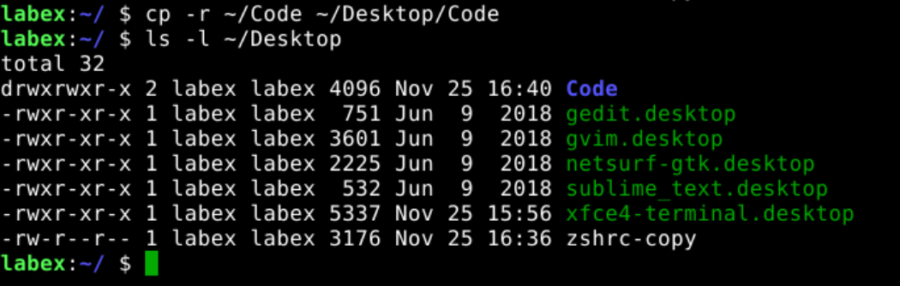
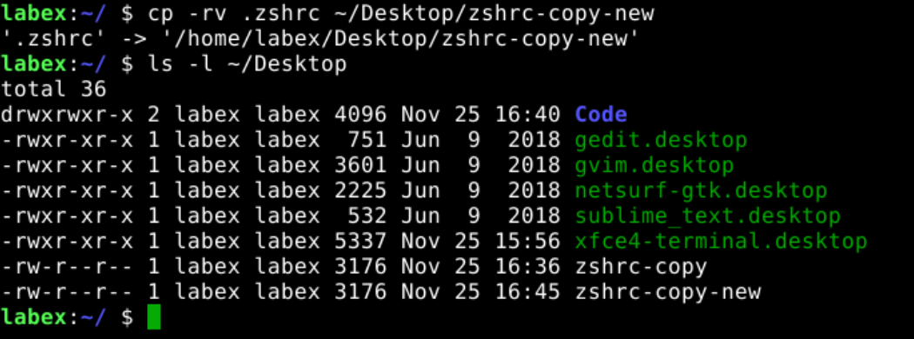

# Copy files and directories

`cp` is a command that allows you to copy files and directories.

## Copy files

The following example shows how to copy the `~/.zshrc` file to the `~/Desktop/zshrc-copy`.

```bash
cp ~/.zshrc ~/Desktop/zshrc-copy
ls -l ~/Desktop
```



## Copy directories

The following example shows how to copy the `~/Code` directory to the `~/Desktop`.

```bash
cp -r ~/Code ~/Desktop/Code
ls -l ~/Desktop
```



## Copy files and directories with details

The following example shows how to copy the `~/.zshrc` file to the `~/Desktop` directory with details.

```bash
cp -rv ~/.zshrc ~/Desktop/zshrc-copy-new
ls -l ~/Desktop
```


