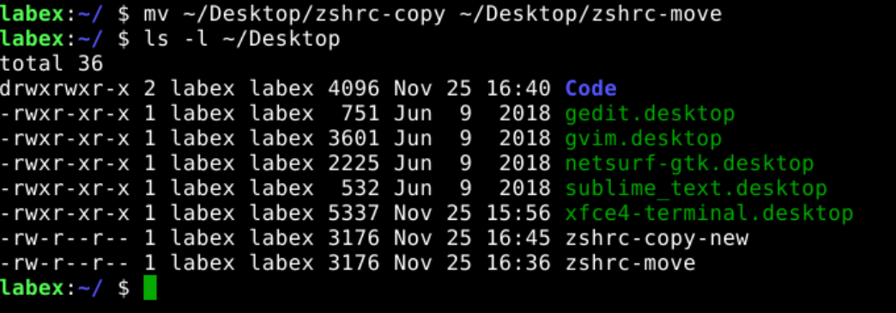
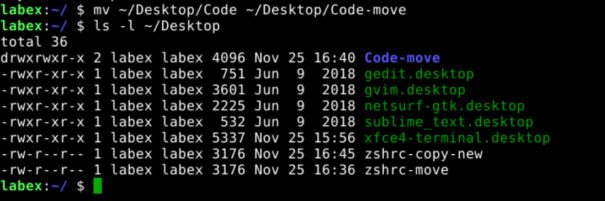

# Move Files and Directories

`mv` is a command that allows you to move files and directories.

## Move Files

The following example shows how to move the `~/Desktop/zshrc-copy` file to the `~/Desktop/zshrc-move`.

```bash
mv ~/Desktop/zshrc-copy ~/Desktop/zshrc-move
ls -l ~/Desktop
```



## Move Directories

The following example shows how to move the `~/Desktop/Code` directory to the `~/Desktop/Code-move`.

```bash
mv ~/Desktop/Code ~/Desktop/Code-move
ls -l ~/Desktop
```



## Move Files and Directories With Details

The following example shows how to move the `~/Desktop/zshrc-copy-new` file to the `~/Desktop/zshrc-move-new` directory with details.

```bash
mv -v ~/Desktop/zshrc-copy-new ~/Desktop/zshrc-move-new
ls -l ~/Desktop
```


