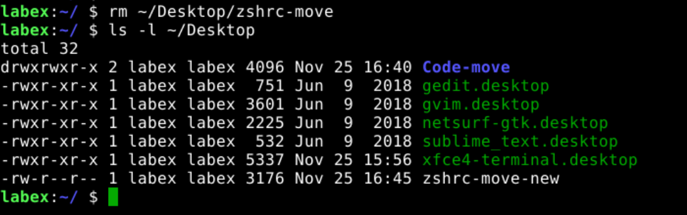
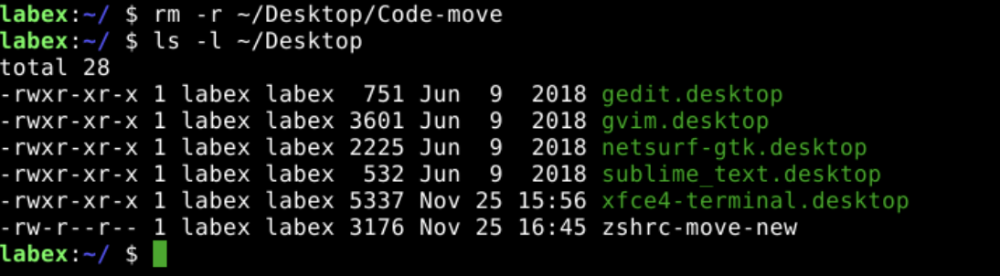

# Remove files and directories

`rm` is a command that allows you to remove(delete) files and directories.

## Remove files

The following example shows how to remove the `~/Desktop/zshrc-move` file.

```bash
rm ~/Desktop/zshrc-move
ls -l ~/Desktop
```



## Remove directories

The following example shows how to remove the `~/Desktop/Code-move` directory.

```bash
rm -r ~/Desktop/Code-move
ls -l ~/Desktop
```



## Remove files and directories with details

The following example shows how to remove the `~/Desktop/zshrc-move-new` file with details.

```bash
rm -v ~/Desktop/zshrc-move-new
ls -l ~/Desktop
```


## Remove files and directories without confirmation

Sometimes you will be asked for confirmation when removing files or directories. The following example shows how to remove files and directories without confirmation.

```bash
rm -rf ~/Code
```
