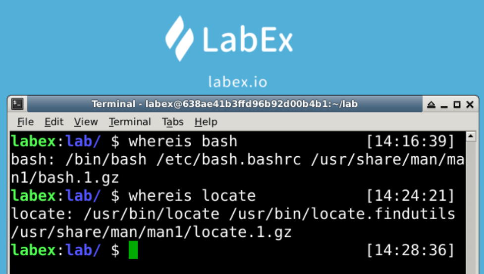

# Using Whereis Command To Search for File

The `whiereis` command will look in the directory set by the environment variable `$PATH` for files that match the criteria, this command will display full information about the file.

We usually use this command to search system programs.

## Locate Executable File

The `whiereis bash` command will search the system file.

```bash
whiereis bash

# or

whiereis locate
```



**Paramters Description**

- `/bin/bash`: The output inforamtion in the screenshot `/bin/bash` means the name of the program.
- `/etc/bash.bashrc`: The output inforamtion in the screenshot `/etc/bash.bashrc` means the path of the program.
- `/usr/share/man/man1/bash.1.gz`: The output inforamtion in the screenshot `/usr/share/man/man1/bash.1.gz` means the path of the man manual.
