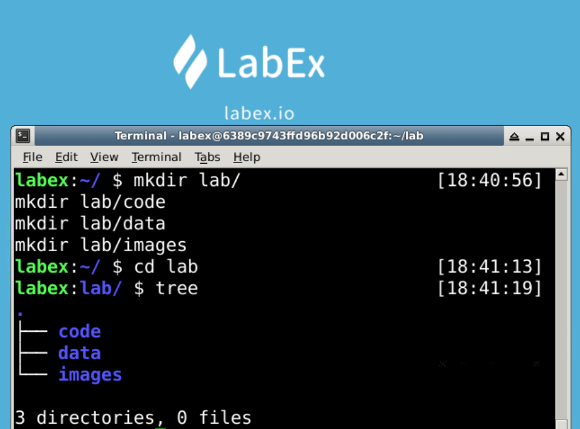
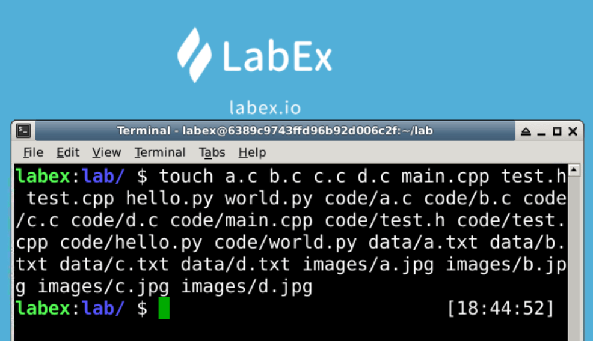

# Find File

The `find` command searches for files or directories by name, usually the `find` command needs paramters for searching.

To facilitate the experiment, the startup script will create new folders and files.





## Find Files With a Certain Extension in Current Directory and Subdirectories

The `find . -name "*.cpp"` command find files in the current directory. The following example shows how to find all the cpp files in the current directory and subdirectories.

```bash
find . -name "*.cpp"

# or

find . -name '*.cpp'
```


**Parameter Description**

- `.`: The dot character (`.`) is a special character in Unix, it indicates the current directory.
- `-name`: The `-name` parameter is used to search for a file or directory by name.
- `*.cpp`: The asterisk character (`*.cpp`) is a special character in Unix, it indicates the file or directory that is .cpp extension.

## Find All Files in Current Directory and Subdirectories

The `find . -type f` command find all files in the current directory and subdirectories. The following example shows how to find all files in the current directory and subdirectories.

```bash
find. -type f
```


**Parameter Description**

- `.`: The dot character (`.`) is a special character in Unix, it indicates the current directory.
- `-type`: The `-type` parameter is used to search for a file or directory by type.
- `f`: The `f` character (`f`) is a special character in Unix, it indicates a file.
- `d`: The `d` character (`d`) is a special character in Unix, it indicates a directory.

