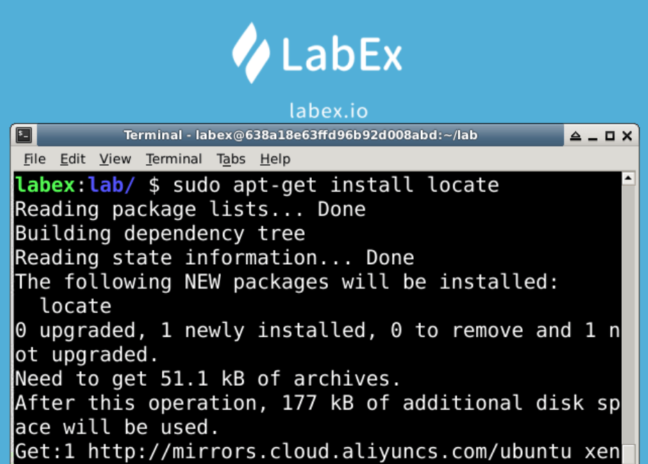
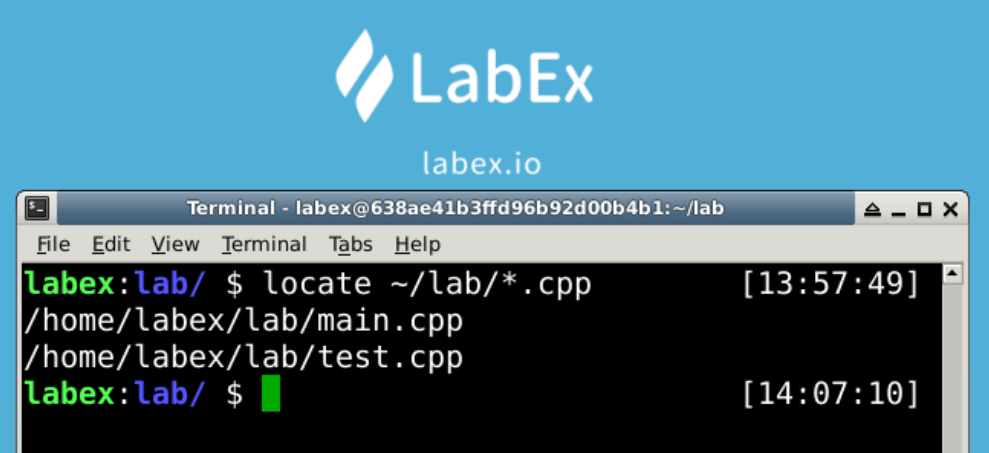

# File Location

The `locate` command is used to find eligible documents, it will go to the database where the names of documents and directories are stored, to find the documents or directories that meet the conditions of the model style.

Once new file has been created we need to execute the `sudo updatedb` command to save the new file to the database.




## Locate File With Full Name

The `locate test.cpp` command will search the system for all files named test.cpp, the result is retrieved from the database.

```bash
locate test.cpp
```


## Locate Files With Regular Formula

The `locate *.cpp` command will search the system for all files whose name contains *.cpp, the result is retrieved from the database.

```bash
locate *.cpp
```


## Locate Files in the Specified Directory

The `locate ~/lab/*.cpp` command will search all files in the specified directory, the result is retrieved from the database.

```bash
locate ~/lab/*.cpp
```



