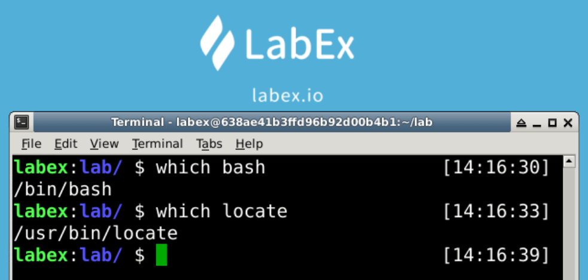

# Using Which Command To Search for File

The `which` command will look in the directory set by the environment variable `$PATH` for files that match the criteria.

We usually use this command to search system programs.

## Locate Executable File

The `which bash` command will search the system file.

```bash
which bash

# or

which locate
```


