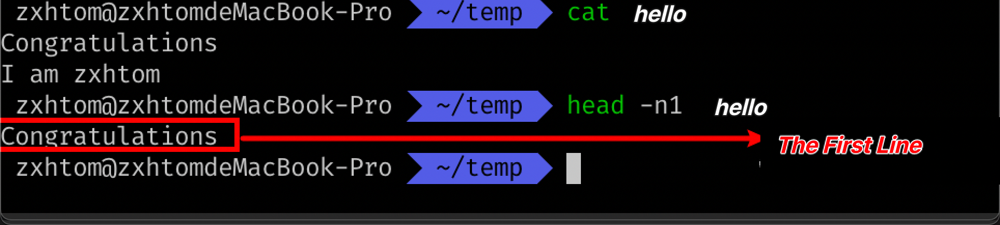

# Operator Contents

the `head` is a command that allows you to view pointed scope content.

## Get Row Data

The following example shows how to view the first row of data under the `~/temp/hello`.

```bash
head -n1 ~/temp/hello
```



## Get Byte Data

The following example shows how to view the first byte of data under `~/temp/hello`.

```bash
head -c1 ~/temp/hello
```


