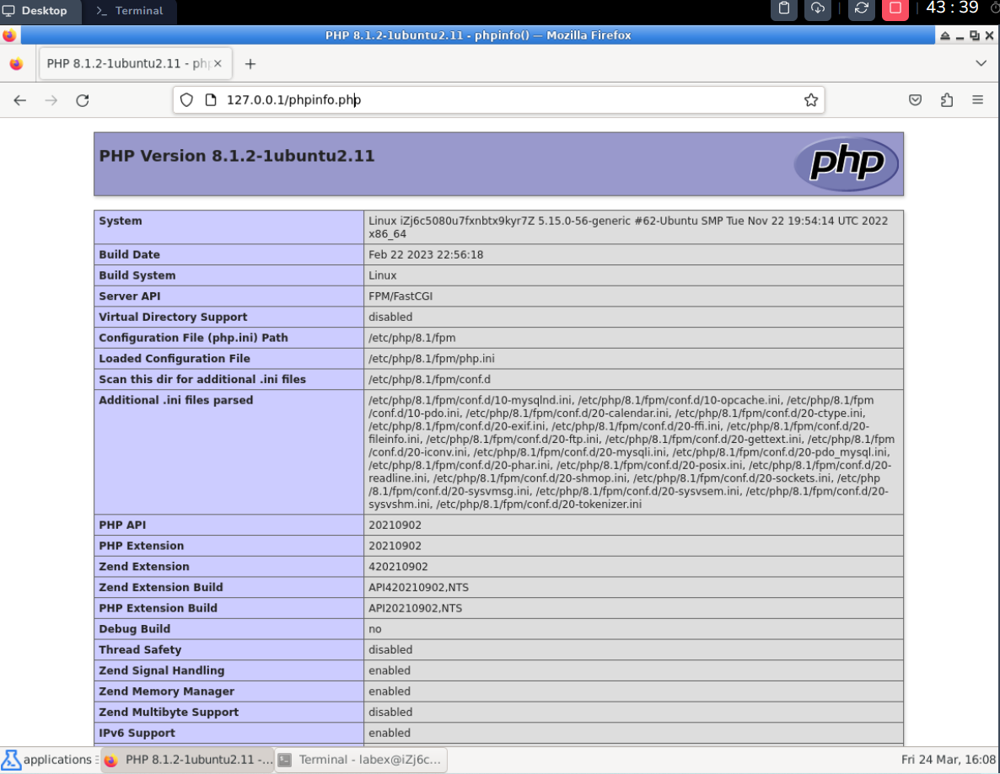

# Verify

Type `http://127.0.0.1/phpinfo.php` in the address bar of your browser to access it.

The access result is shown below, and the PHP configuration information page is successfully viewed, which means the LNMP environment is successfully deployed.



Alternatively, the `curl` command can be used to check.

```bash
curl http://127.0.0.1/phpinfo.php -I
```
