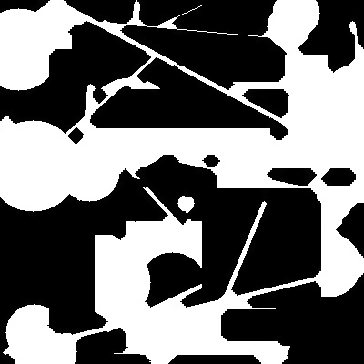

# Perform Dilation and Erosion Operations

**Introduction:**

Dilation and erosion are basic morphological transformations used to expand or shrink the foreground (white) region of an image, respectively. In this sub-challenge, you will apply these transformations to the binary image generated by `generate_binary_image` function.

## Requirements:

- Use different structuring elements (rectangular, elliptical, cross) and sizes.
- Apply dilation and erosion operations with various iterations.

## TODO:

Please complete the `apply_dilation_and_erosion` function in the file `/home/labex/project/apply_dilation_and_erosion.py`.

1. The `apply_dilation_and_erosion` takes the following parameters:
   - `image`: The binary image generated in "generate_binary_image.py".
   - `kernel_shape`: The shape of the structuring element ("rectangular", "elliptical", or "cross").
   - `kernel_size`: The size of the structuring element.
   - `dilation_iterations`: The number of dilation iterations to apply.
   - `erosion_iterations`: The number of erosion iterations to apply.
2. Please use `cv2.getStructuringElement` to generate structing elements, and `cv2.dilate()` and `cv2.erode()` to implement dilation and erosion.
3. Return the processed image.

## example

Take `apply_dilation_and_erosion(image, "cross", 5, 3, 3)` as an example to process the target binary image.

- The shape of the structuring element is "cross".
- The size of the structuring element is 5.
- The number of dilation iterations to apply is 3.
- The number of erosion iterations to apply is 3.

```python
image = cv2.imread("example_image.jpg", cv2.COLOR_BGR2GRAY)
result = apply_dilation_and_erosion(image, "cross", 5, 3, 3)
```

The image processing result is as follows:



You can compare the difference between it and before it was processed.

The original image before processing looks like this:


