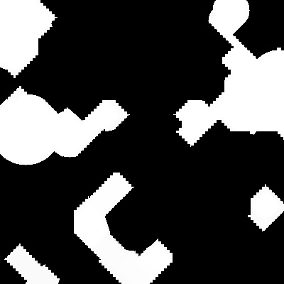
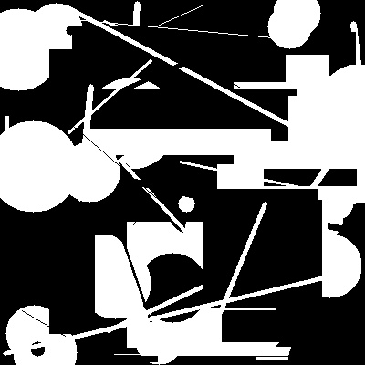

# Implement Opening and Closing Operations

Opening and closing are morphological transformations that combine erosion and dilation operations to remove noise or fill holes in an image, respectively. In this sub-challenge, you will apply these transformations to the binary image generated by `generate_binary_image` function.

## Requirements:

- Use different structuring elements (rectangular, elliptical, cross-shaped) and sizes.
- Apply opening and closing operations with various iterations.

## TODO:

Please complete the `apply_opening_and_closing` function in the file `/home/labex/project/apply_opening_and_closing.py`.

1. The `apply_opening_and_closing` function takes the following parameters:
   - `image`: The binary image generated in Sub-Challenge 1.
   - `kernel_shape`: The shape of the structuring element ("rectangular", "elliptical", or "cross").
   - `kernel_size`: The size of the structuring element.
   - `opening_iterations`: The number of opening iterations to apply.
   - `closing_iterations`: The number of closing iterations to apply.
2. Apply opening and closing operations using the provided parameters.
3. Use the `cv2.getStructuringElement` function and the `cv2.morphologyEx` function.
4. Return the processed image.

## example

Take apply_opening_and_closing(image, "cross", 9, 5, 5) as an example to process the target binary image.

- The shape of the structuring element is "cross".
- The size of the structuring element is 9.
- The number of opening iterations to apply is 5.
- The number of closing iterations to apply is 5.

```python
image = cv2.imread("example_image.jpg", cv2.COLOR_BGR2GRAY)
result = apply_opening_and_closing(image, "cross", 9, 5, 5)
```

The image processing result is as follows:



You can compare the difference between it and before it was processed.

The original image before processing looks like this:


