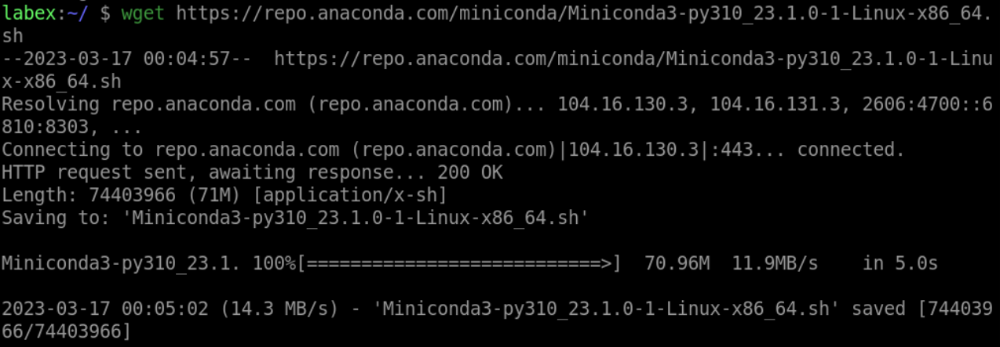
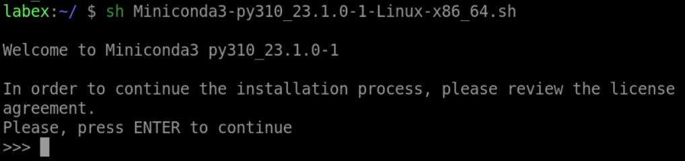
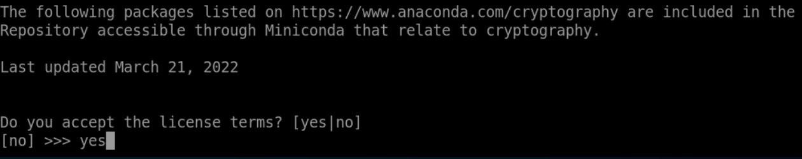
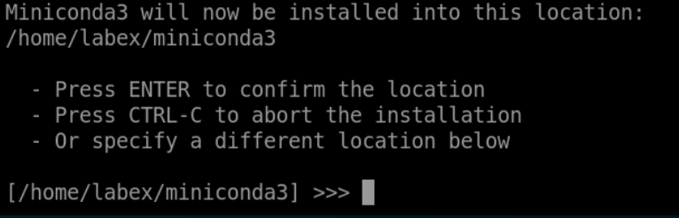
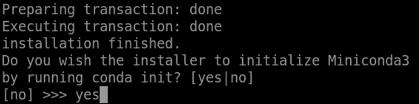

# Solution

# Install conda

## Download the `cond` installation script

```bash
wget https://repo.anaconda.com/miniconda/Miniconda3-py310_23.1.0-1-Linux-x86_64.sh
```



## Install conda

1. Execute the `conda` installation script.When you see this prompt, press the `Enter` key to continue.

```bash
sh Miniconda3-py310_23.1.0-1-Linux-x86_64.sh
```



2. Press the `down` key to read the license content until the following prompt appears, type `yes` and press `Enter` key.



3. Select the installation path, here we choose the default directory(`/home/labex/miniconda3`).



4. When the script prompts for the following, type `yes` and press `Enter` key.



5. The installation is successful when the script prompts the following.


6. Now, Execute the `zsh` command and go to the new shell.

```bash
zsh
```


# Package Management

```bash
# Create a new Conda environment called "package_management"
conda create --name package_management

# Activate the "package_management" environment
conda activate package_management

# Install the following packages: cerberus, watchdog, arrow
conda install cerberus watchdog arrow

# Update the pandas package to the latest version
conda update watchdog

# Remove the matplotlib package from the environment
conda remove arrow
```

# Environment Management

```bash
# Create a new Conda environment called "environment_management"
conda create --name environment_management

# Activate the "environment_management" environment
conda activate environment_management

# Install the following packages: h5py, scipy, nose
conda install h5py scipy nose

# Export the "environment_management" environment to an environment file called "environment.yml"
conda env export > environment.yml

# Deactivate the "environment_management" environment
conda deactivate

# Create a new Conda environment called "imported_environment" and import the "environment.yml" file into the "imported_environment" environment
conda env create --name imported_environment --file environment.yml
```
