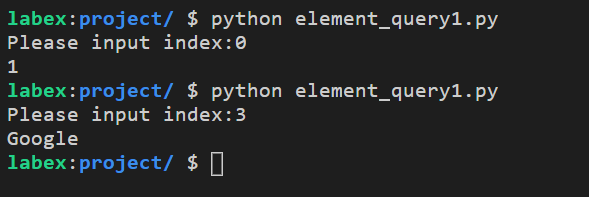

# Query of Elements 1

Write code that outputs the corresponding element after entering the index of the element in the list.

The list is as follows:

```python
_list = [1, 3, 'Aaron', "Google", 2.33]
```

## Example



## Requirements

- The program should be named `element_query1.py`.
- Do not modify the elements in the list.
