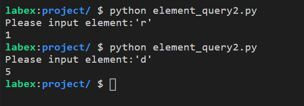

# Query of Elements 2

Write code that outputs the corresponding index after entering the elements in the list.

The list is as follows:

```python
_list = ["g", "r", "o", "u", "n", "d"]
```

## Example



## Requirements

- The program should be named `element_query2.py`.
- Do not modify the elements in the list.
