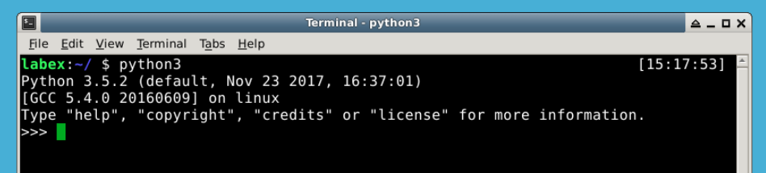

# Python Interpreter

First, let's get to know Python Interpreter. Python Interpreter is a program that reads and executes Python code. It is also called Python Shell. It is a very useful tool for testing and debugging Python code. You can run Python Interpreter by typing `python` in your terminal. You should see something like this:

```bash
python
```


