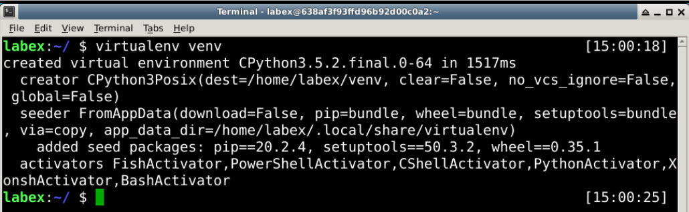

# Create Virtual Environment

First，let us to create a python virtual enviroment.

```bash
virtualenv venv
```

Now we have a virtual environment named "venv". Next, we can install python packages in the virtual environment.


