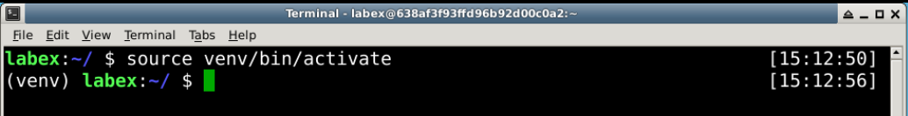
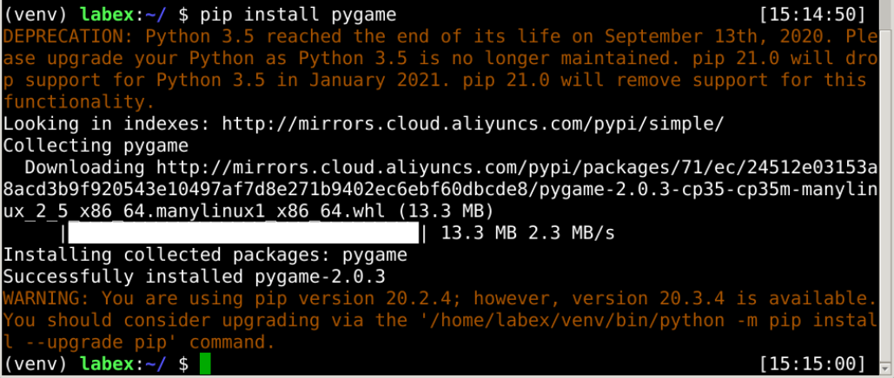
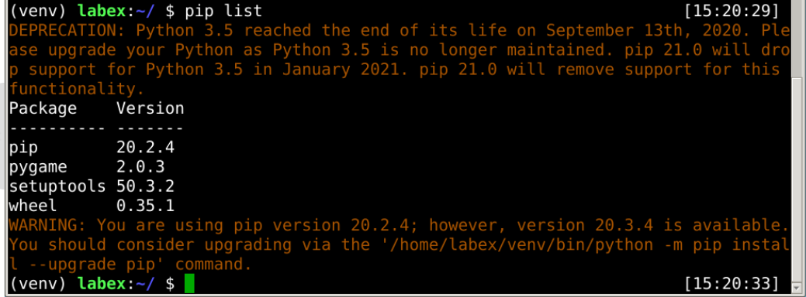
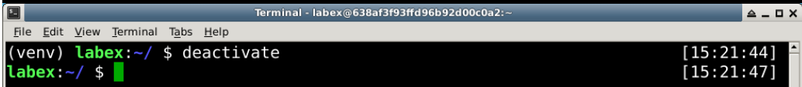
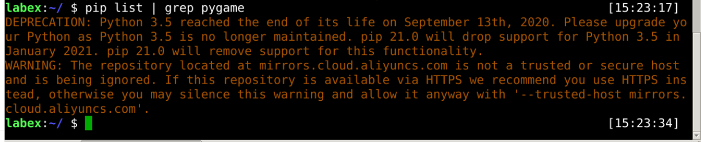

# Using Virtual Environment

Now, we use the `source` command to activate the virtual environment:

```bash
source venv/bin/activate
```



Then, we install a third-path package:

```bash
pip install pygame
```



pygame is success installed in this environment.

```bash
pip list
```



Finally, use `deactivate` command to exit the virtual environment:



We can see pygame is not installed in the main environment.


