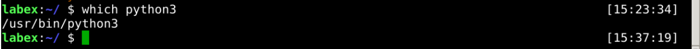

# Different Python Version

We can also create a virtual environment using the python version we want.

e.g. create a Python3 virtual environment, first, we must know where the Python3 is:


```bash
which python3
```



then we can use `-p` to assign it:

```bash
virtualenv -p /usr/bin/python3 venv3
```

